# despr2_1_apache
> Repositorio creado para la práctica "Actividad 2.1 - Instalación y despliegue básico en Apache".
## Descripición del proyecto
El objetivo de esta práctica es instalar y configurar Apache en una máquina virtual (Ubuntu 22.04) y desplegar un sitio web estático sencillo con navegación entre páginas, imágenes y estilos.

## Pasos seguidos para la instalación y despliegue
+ 1 Creación de la mv:
    + Crea una VM como clon enlazado de la VM base Ubuntu-Server-Base.ova proporcionada en el repositorio del curso:
    
    + Configuración de la red:
    
    
    + Iniciar la mv y acceder al host por SSH
    
    
+ 2 Preparación del entorno:
    + Actualización de paquetes:
    
    + Instalación apache2: 
    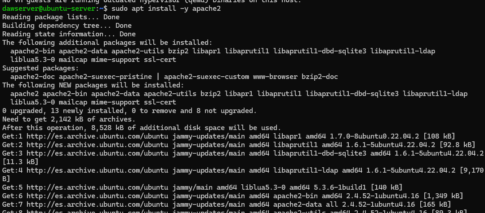
    + Configuración del firewall para permitir tráfico HTTP y HTTPS:
    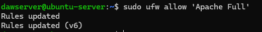
    + Verificacion de las reglas aplicadas:
    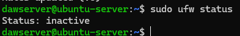
    + Configuración y habilitación del tráfico ssh, HTTP y HTTPS: 
    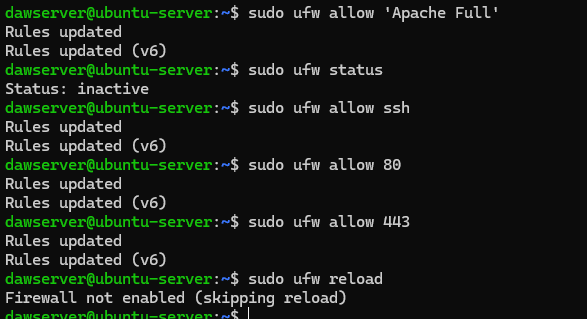
    + Habilitación del firewall:
    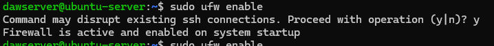
3. Comprobación básica:
    + Comprobación que el servicio está activo:
    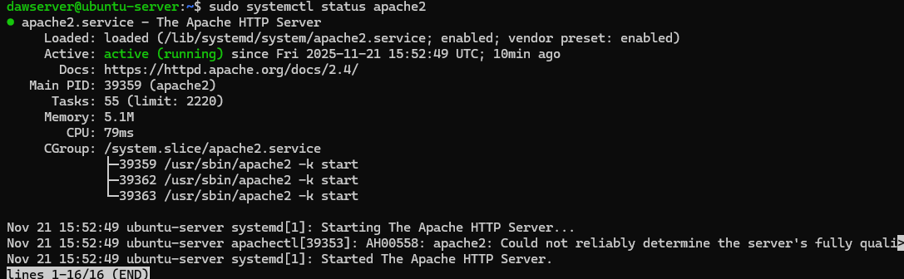
    + Visualización de http://localhost:8081/
    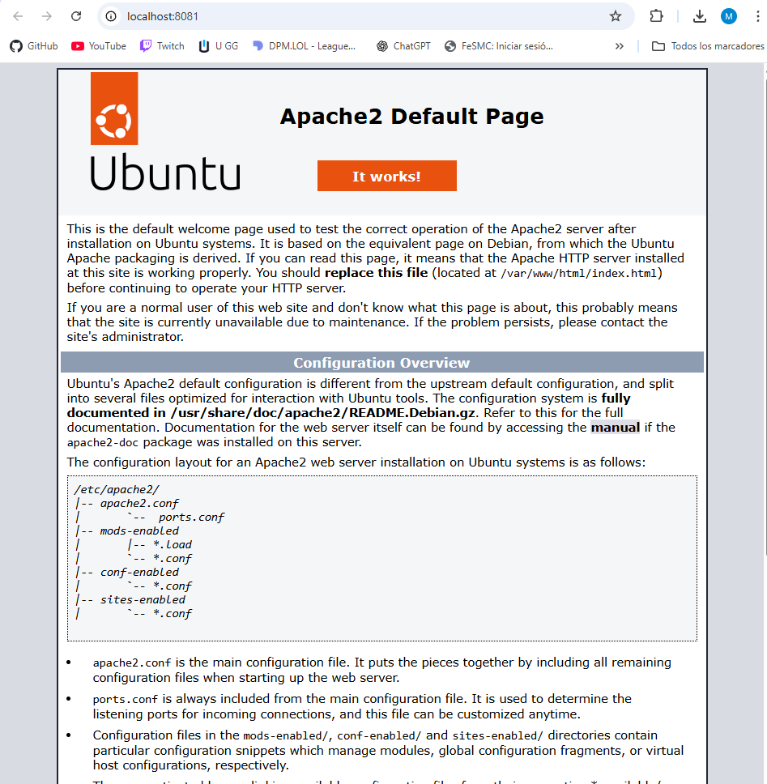

4. Desplegación del sitio de ejemplo: 
    + Copia los archivos del sitio de ejemplo a /var/www/html/:
    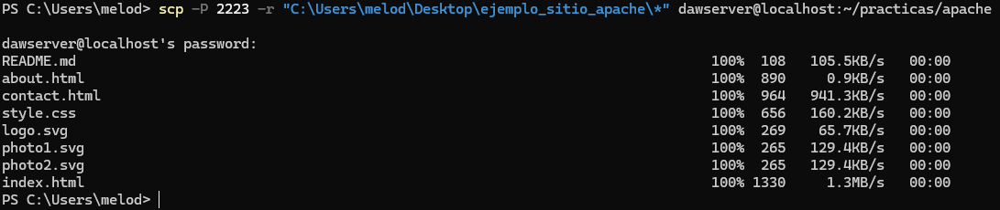
    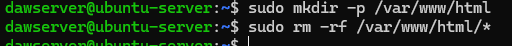
    + Comprobación del localhost:8081
    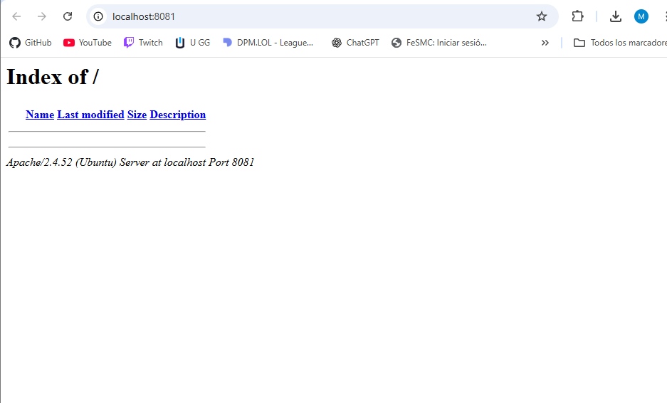
    
    + Ajustar permisos y propiedades de los archivos: 
    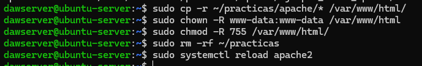

5. Comprobación final: 
    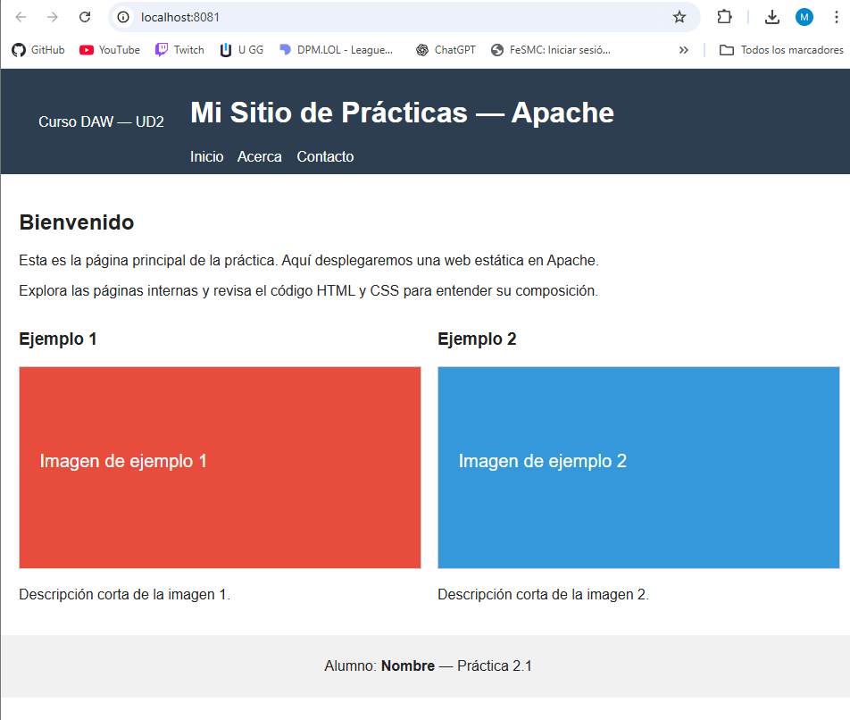

6. Creación de snapshot:
    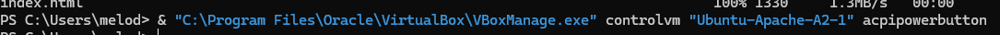
    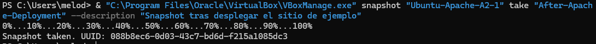

## Problemas encontrados durante la configuración y despligue, y su solución
No he encontrado problemas significativos al realizar las tareas concretas de la práctica. La única dificultad fue que, en el ordenador del instituto, las descargas tardaban tanto que a veces tenía que apagar la máquina virtual y volver a empezar, lo que generaba un ciclo repetitivo de descargas.