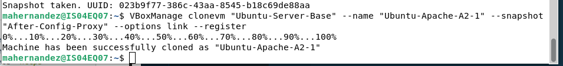
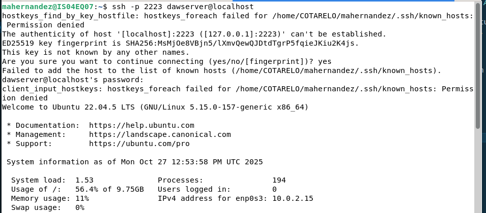
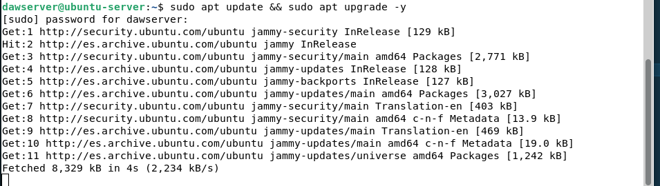

# despr2_1_apache
> Repositorio creado para la práctica "Actividad 2.1 - Instalación y despliegue básico en Apache".
## Descripición del proyecto
El objetivo de esta práctica es instalar y configurar Apache en una máquina virtual (Ubuntu 22.04) y desplegar un sitio web estático sencillo con navegación entre páginas, imágenes y estilos.

## Pasos seguidos para la instalación y despliegue
+ 1 Creación de la mv:
    + Crea una VM como clon enlazado de la VM base Ubuntu-Server-Base.ova proporcionada en el repositorio del curso:
    
    + Configuración de la red:
    
    
    + Iniciar la mv y acceder al host por SSH
    
    
+ 2 Preparación del entorno:
    + Actualización de paquetes:
    
    + Instalción apache2: 

## Problemas encontrados durante la configuración y despligue, y su solución
